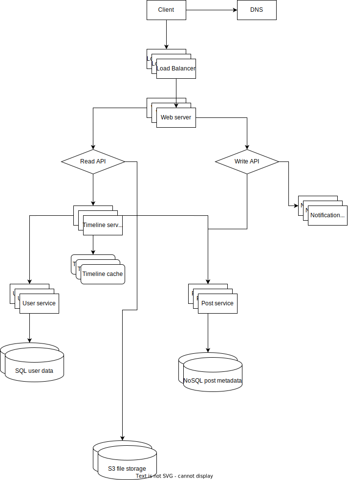

Requirements:
- Read news Feed
- read comments / likes
- write comments / likes

non - func requirements:
- high avalability
- read heavy service
- photo size: 4.4 mb
- video size: up to 4 gb
- Simultaneous users: 1,365 bln
- New posts every day: 95 mln

1) Client uses DNS to to get host ip. DNS can be a geo load balancer - return ip of server that is closer to the user.
2) We use load balancer to pick best Web server
3) Generally speaking we have 2 flows: read flow to get news feed, and write flow to add like or comment.

Read Flow:
4) Timeline service is in charge of constructing list of posts that user will see. It uses advanced algorith,
that takes into account users preferences and recent posts characteristics. For that we need to fetch current user info
and info about recent posts. We store the result in cache, so if user request feed update again, we will fetch from the database
only new posts and combine them with already constructed timeline in cache.

Write Flow:
4) save new like / comment in post service / post db
5) sends notification to the owner of the post, to let them know about new like / comment.

Since for post metadata we can omit joins, we can use noSQL for better clasterisation of nodes: setup sharding, federation (more than one master node) etc..

Bottleneck: Post service and post metdadata DB: both read and write API depends on it.
SBP: load balancer, that takes all the load;

